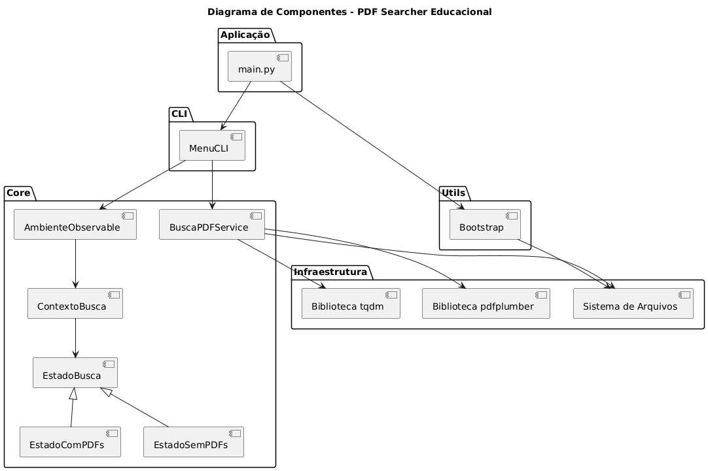
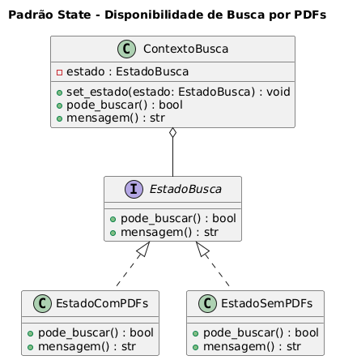
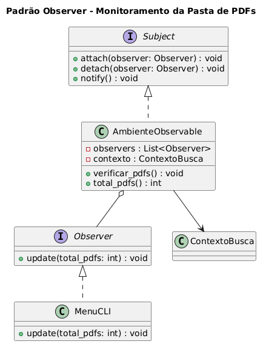
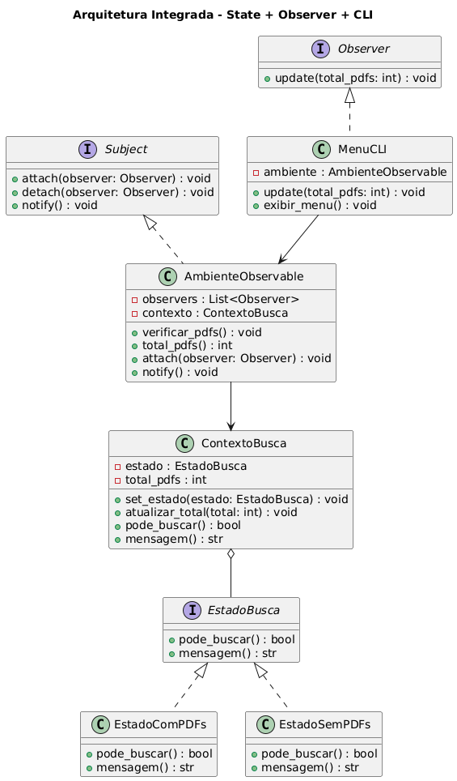
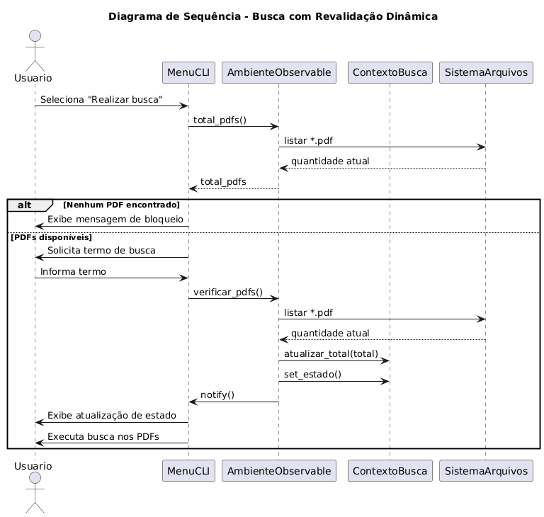

# 🔍 PDF Searcher Educacional

**Autor:** Maxwell de Oliveira Chaves  
**Ano:** 2025  
**Licença:** [CC BY-NC-SA 4.0 International](LICENSE.md)

---

## 📘 Descrição do Projeto

O **PDF Searcher Educacional** é um aplicativo de linha de comando (CLI) desenvolvido em Python para realizar **buscas textuais com filtros** em múltiplos arquivos PDF localizados em uma pasta específica.

O sistema foi concebido para auxiliar em **estudos acadêmicos e avaliações pedagógicas**, permitindo a localização rápida de termos, expressões ou conceitos dentro de materiais didáticos (apostilas, aulas, textos de referência), mesmo quando não há indicação explícita da origem do conteúdo.

---

## 🧠 Objetivo Educacional

O projeto tem como objetivos principais:

* Otimizar o processo de **busca e revisão de conteúdo educacional**;
* Demonstrar **boas práticas de leitura e processamento de PDFs com Python**;
* Apresentar, de forma didática, a aplicação dos padrões de projeto **State** e **Observer**;
* Servir como **material de apoio** para estudantes e professores que estudam automação, arquitetura de software e organização de código.

---

## 🏗️ Arquitetura e Decisões Técnicas

O projeto foi estruturado de forma modular, com separação clara de responsabilidades:

### 📐 Organização em Módulos

* **core/**  
  Contém a lógica central do domínio (busca em PDFs, estados do sistema e regras de negócio).

* **cli/**  
  Responsável pela interface de linha de comando, menus e interação com o usuário.

* **utils/**  
  Módulos utilitários, incluindo a inicialização do ambiente e verificação de pastas.



---

### 🧩 Padrões de Projeto Utilizados

#### ✔ State

O padrão **State** é utilizado para representar os estados do ambiente de execução, como:

* Ambiente **sem PDFs disponíveis**;
* Ambiente **pronto para busca**.



Cada estado define de forma explícita se determinadas ações (como a busca) são permitidas, garantindo clareza e coesão no comportamento do sistema.

#### ✔ Observer

O padrão **Observer** é empregado para:

* Monitorar alterações na pasta `pdfs/`;
* Notificar automaticamente a interface (CLI) quando o estado do ambiente muda;
* Atualizar mensagens e permissões de uso sem necessidade de reiniciar o aplicativo.

---


⚠️ **Importante:** Antes de qualquer operação crítica (como realizar uma busca), o sistema **revalida o estado real do filesystem**, evitando inconsistências causadas por alterações externas (ex.: remoção manual de PDFs).

---



---

## ⚙️ Requisitos

Para executar o projeto, é necessário possuir:

* **Python 3.8+**

* **Bibliotecas:** ``pdfplumber-0.11.0``, ``tqdm-4.65.0``

* Sistema operacional compatível: **Windows, Linux ou macOS**

---

## 🚀 Como Executar

1. Clone o repositório:

   ```bash
   git clone https://github.com/maxwelldeveloper7/busca_pdf.git
   cd busca_pdf/
   ```

2. Crie um ambiente virtual isolado:

   ```bash
   python -m venv venv
   ```

3. Ative o ambiente virtual:

   ```bash
   source venv/bin/activate  # Linux/Mac
   venv\Scripts\activate     # Windows
   ```

4. Instale as dependências:

   ```bash
   pip install -r requirements.txt
   ```

5. Execute o aplicativo:

   ```bash
   python main.py
   ```

6. Caso a pasta `pdfs/` não exista, ela será **criada automaticamente**.

7. Copie os arquivos PDF desejados para a pasta `pdfs/`.

8. Utilize o menu para:

   * Realizar buscas;
   * Atualizar o estado do ambiente;
   * Visualizar ou limpar logs.

O sistema salvará os resultados em:

```bash
/resultados/log_busca.txt
```

---

## 🗂️ Estrutura de Pastas

```bash
📦 pdf-searcher-educacional
 ┣ 📂 core/            # Lógica central e regras de negócio
 ┣ 📂 cli/             # Interface de linha de comando
 ┣ 📂 utils/           # Inicialização e utilidades
 ┣ 📂 pdfs/            # Arquivos PDF (não incluídos)
 ┣ 📂 resultados/      # Logs e relatórios de busca
 ┣ 📜 main.py          # Ponto de entrada da aplicação
 ┣ 📜 LICENSE.md       # Termos da licença
 ┣ 📜 .gitignore       # Arquivos ignorados pelo Git
 ┣ 📜 CHANGELOG.md     # Arquivos ignorados pelo Git
 ┗ 📜 README.md        # Documentação do projeto
```

---

## 🧱 Boas Práticas Implementadas

* Separação clara de responsabilidades por módulo;
* Uso de **Pathlib** para manipulação de caminhos;
* Validação do estado real do filesystem antes de ações críticas;
* Aplicação consciente dos padrões **State** e **Observer**;
* Tratamento de exceções para PDFs inválidos ou corrompidos;
* Código comentado com foco didático;
* Conformidade com o padrão **PEP 8**.

---

## ⚠️ Aviso Legal e Ético

> Os arquivos PDF utilizados pelo aplicativo **não estão incluídos no repositório** e **não devem ser redistribuídos**, pois são protegidos por direitos autorais.
>
> Este software opera exclusivamente sobre **cópias locais** e tem finalidade **educacional e não comercial**.

---

## 📜 Licença

Este projeto é licenciado sob os termos da
**Creative Commons Atribuição–NãoComercial–CompartilhaIgual 4.0 Internacional (CC BY-NC-SA 4.0)**.

Você pode:

* Compartilhar — copiar e redistribuir o material;
* Adaptar — remixar, transformar e criar a partir do material;

Desde que:

* Seja atribuída a autoria a **Maxwell de Oliveira Chaves**;
* Não haja uso comercial;
* As modificações sejam distribuídas sob a mesma licença.

📄 Texto completo da licença:  
[https://creativecommons.org/licenses/by-nc-sa/4.0/legalcode.pt](https://creativecommons.org/licenses/by-nc-sa/4.0/legalcode.pt)

---

## 💬 Contato

* **Autor:** Maxwell de Oliveira Chaves  \
* **E-mail profissional:** [maxwellchaves1844@gmail.com](mailto:maxwellchaves1844@gmail.com)  \
* **GitHub:** [https://github.com/maxwelldeveloper7](https://github.com/maxwelldeveloper7)  \
* **LinkedIn:** [https://www.linkedin.com/in/maxwell-oliveira-chaves/](https://www.linkedin.com/in/maxwell-oliveira-chaves/)
